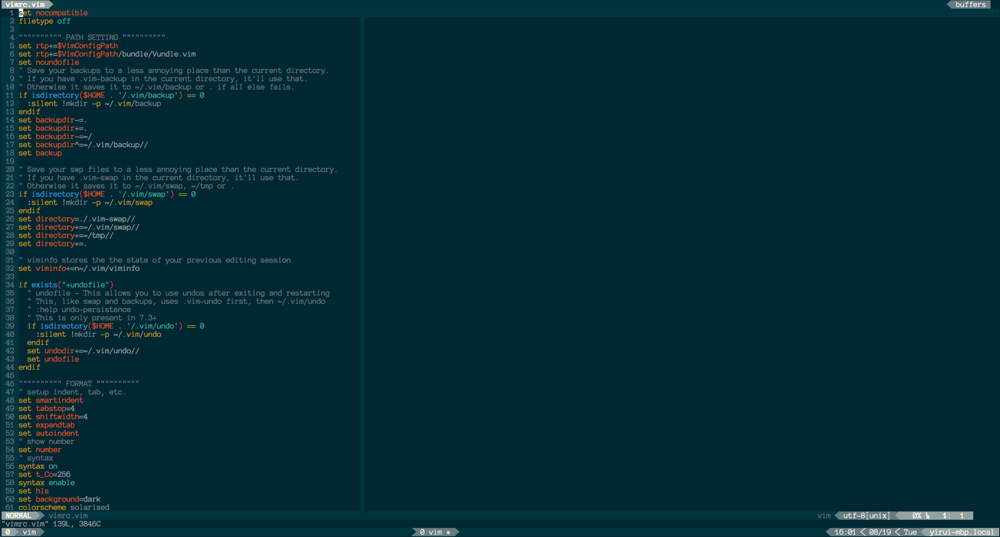

VIMRC by Yirui
====================

# Requirement
+ latest fat vim and python
+ to support better theme, change terminal to support 256 color
+ to support better status bar, change terminal to use patched font (search powerline-font for detail)

# Plugin Special Install
> 0. in your $HOME/.vimrc, define var VimConfigPath to this vimrc folder and source vimrc.vim under vimrc
> 1. `git submodule update --init --recursive`
> 2. cd YCM and exe install.sh
> 3. cd vimproc and exe make
> 4. cd zsh-git-prompt and type `cabal build`
> 5. Create `~/vim_projects` folder in order to save the vim session.
> 6. [Install tmux plugin manager](https://github.com/tmux-plugins/tmux-resurrect#installation-with-tmux-plugin-manager-recommended)
> 7. Install tmux plugins as what described above.
> 8. `brew install reattach-to-user-namespace`

# TODO
+ YCM adv setting
+ script to do this README

